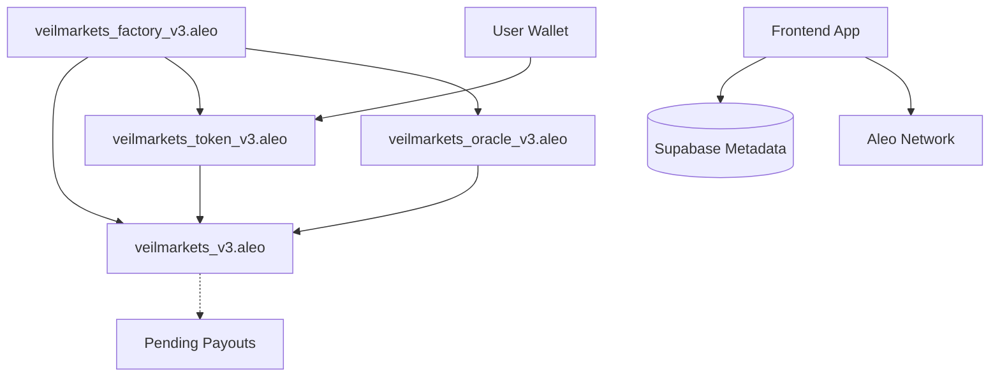

# VeilMarkets — Privacy-First Prediction Markets on Aleo

**VeilMarkets** is a **privacy-first decentralized prediction market platform** built on Aleo. Users can create markets, place bets, and claim winnings **without revealing their identity, chosen outcome, or wager amounts**, leveraging zero-knowledge proofs to guarantee fairness and correctness.

---

## Table of Contents

- [What it Does](#what-it-does)
- [Problem Statement](#problem-statement)
- [Features](#features)
- [Tech Stack](#tech-stack)
- [Architecture](#architecture)
- [Getting Started](#getting-started)
- [Contributing](#contributing)
- [License](#license)

---

## What it Does

VeilMarkets allows users to:

- Create **binary outcome prediction markets**
- Place **private bets** that are encrypted and verifiable
- Resolve markets using **trusted oracle input**
- Claim winnings privately via **zero-knowledge proofs**

Privacy is at the core of the platform: **no public order books, no visible wager amounts, no identity leaks**.

---

## Problem Statement

Traditional on-chain prediction markets expose sensitive data:

- Participant identities
- Bet amounts and chosen outcomes
- Market strategies and signals

This leads to **manipulation, MEV, exposure of high-value bettors, and friction for institutions**. VeilMarkets solves this by ensuring **all bets are private**, while still allowing **verifiable settlement**.

---

## Features

- Binary outcome markets (Yes/No) with V2 pari-mutuel logic
- Real-time **Pool Analytics**: Automated Yes/No ratios and implied probability
- Live **Participant Tracking**: Transparent on-chain engagement metrics
- **Block-based Countdown**: Precise market closing estimations
- Private bet submission and encrypted storage
- Market resolution via oracle with zero-knowledge proofs
- Settlement and winnings claim with verifiable privacy
- **Aleo Credit Tracking**: Integrated balance display for shielded credits
- User dashboard (“My Bets”) showing joined market metadata and private history

---

## Tech Stack

- **Aleo** — Layer-1 blockchain with programmable privacy
- **Leo** — Aleo smart contract language for bet and settlement logic
- **React / Vite** — Frontend framework for premium UX
- **Supabase** — Off-chain metadata storage for rich market details
- **Tailwind CSS** — Modern, responsive UI design
- **TypeScript** — Type safety across the entire stack

---

## Architecture

VeilMarkets uses a modular **4-program architecture** to ensure scalability, security, and Aleo compliance:

## Frontend Integration (v3)

### Transaction Flow Changes
1. **Placing a Bet**:
   - Program: `veilmarkets_token_v3.aleo`
   - Transition: `place_bet`
   - **Returns**: `(credits.aleo/credits, EscrowedBet, Future)`
   - > [!IMPORTANT]
     > Ensure the frontend uses the first returned record (`credits`) for wallet balance and the second record (`EscrowedBet`) is stored/minted as the user's position!

2. **Resolving a Market**:
   - **Step 1**: Call `propose_resolution` (Oracle Contract).
   - **Step 2**: Wait 24 hours (Dispute window).
   - **Step 3**: Call `resolve_on_core` (Oracle Contract) to finalize.

### Troubleshooting
- **Error: 'Credits' expected 2 entries, found 5 entries**:
  - **Cause**: You are likely passing an `EscrowedBet` record from the token contract instead of a `credits.aleo/credits` record.
  - **Fix**: Check your wallet filtering logic. Ensure input records for `place_bet` or `register_oracle` are specifically from the `credits.aleo` program.

## Architecture Diagram (v3)


- **veilmarkets_factory_v3.aleo**: System registry and permission management.
- **veilmarkets_v3.aleo**: Core logic for market creation, pool accounting, and pro-rata winnings calculation.
- **veilmarkets_token_v3.aleo**: Integrated pari-mutuel escrow vault. Handles deposits, bet funding, and secure payouts.
- **veilmarkets_oracle_v3.aleo**: Optimistic resolution governance with built-in 24h dispute window and escalation.

---

## Getting Started

1. Clone the repository:

```bash
git clone https://github.com/your-username/veilmarkets.git
cd veilmarkets
```

2. Install dependencies:

```bash
npm install
```

3. Setup Environment Variables:
Create a `.env` file in the root directory:
```bash
VITE_SUPABASE_URL=your_supabase_url
VITE_SUPABASE_ANON_KEY=your_supabase_anon_key
VITE_ALEO_NETWORK=testnet
```

4. Deploy contracts to Aleo Testnet (requires Aleo SDK):
```bash
# Order of deployment
# 1. veilmarkets_factory_v3, 2. veilmarkets_v3, 3. veilmarkets_token_v3, 4. veilmarkets_oracle_v3
cd leo/factory && leo deploy
# Repeat for each program in order (veilmarkets, veilmarkets_token, veilmarkets_oracle)
```

5. **Register Contracts in Factory** (CRITICAL):
After deployment, you must link the contracts in the Factory registry so they can communicate:
```bash
# 1. Register Token Contract
leo execute <factory_contract_address>/register_contract 1u8 <token_contract_address> --broadcast --network testnet
# 2. Register Oracle Contract
leo execute <factory_contract_address>/register_contract 2u8 <oracle_contract_address> --broadcast --network testnet
```

6. Run the frontend locally:
```bash
npm run dev
```

6. Open your browser at `http://localhost:5173` and interact with the UI.

---

## Contributing

We welcome contributions! Please:

- Fork the repo
- Create a feature branch
- Submit a pull request describing your changes
- Ensure privacy and zero-knowledge principles are preserved

---

## License

MIT
